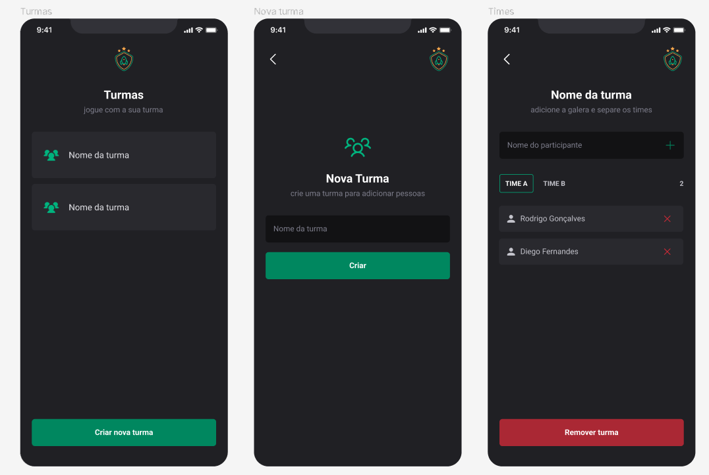

# Ignite teams

<div align="center">
	
</div>

## :dart: Objetivo

Projeto com a proposta de ajudar a organizar pessoas que se reúnem para jogar em turmas desenvolvido com o conteúdo
estudado nas aulas do Chapter II da trilha de React Native do Bootcamp Ignite da Rocketseat.

## :hammer_and_wrench: Ferramentas

- [expo](https://expo.dev/)
- [@expo-google-fonts/roboto](https://www.npmjs.com/package/@expo-google-fonts/roboto)
- [phosphor-react-native](https://phosphoricons.com/)
- [react-native](https://reactnative.dev/)
- [@react-native-async-storage/async-storage](https://react-native-async-storage.github.io/async-storage/docs/install/)
- [@react-navigation/native](https://reactnavigation.org/)
- [styled-components](https://styled-components.com/)
- [typescript](https://www.typescriptlang.org/)

## :desktop_computer: Padronização de código

- [Eslint](https://eslint.org/)
- [Prettier](https://prettier.io/)
- [EditorConfig](https://editorconfig.org/)

## :rocket: Executando o projeto

```bash
// Instale as dependências

yarn install

// Concluindo a instalação rode

yarn android
```
